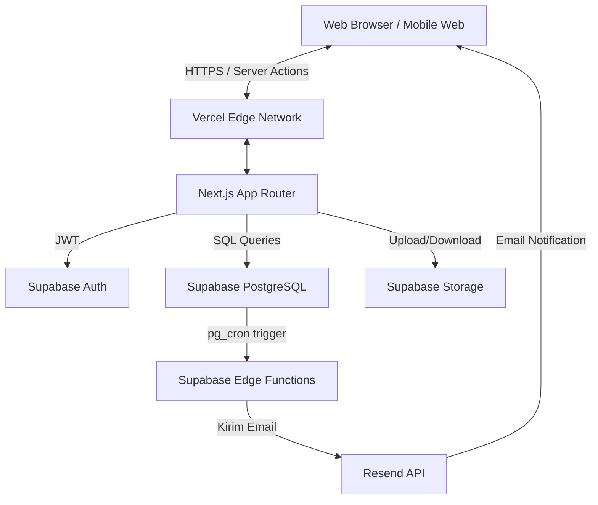
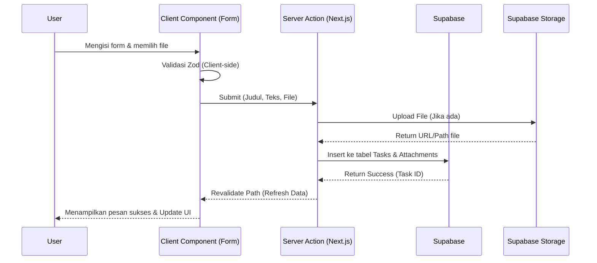
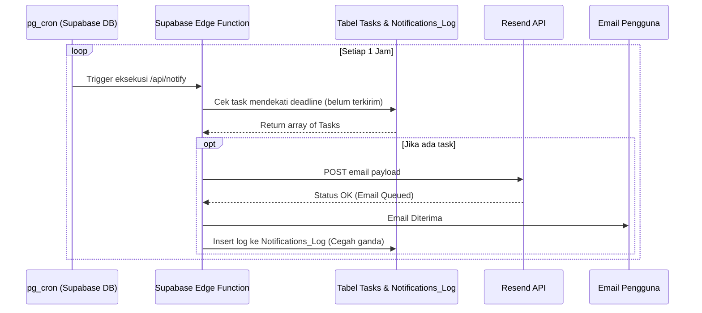

# Software Architecture (Project BesokAja)

## 1. High Level Architecture

Project BesokAja mengadopsi arsitektur *Serverless*, yang berarti tidak ada server konvensional (VPS) yang perlu dikelola secara konstan. Semua beban komputasi didistribusikan ke Vercel (Frontend & Serverless Functions) dan Supabase (Database, Auth, Storage, Edge Functions).

## 2. Layer Architecture (Next.js App Router)
Aplikasi memisahkan *Client Components* dan *Server Components* secara tegas untuk performa optimal.
- **Data Layer:** Supabase Database dengan Row Level Security (RLS). Tidak ada API terpisah yang meng-koneksikan DB ke *client* selain *Server Actions* Next.js.
- **Logic Layer (Backend):** *Server Actions* di Next.js menangani validasi (*Zod*) dan mutasi data (CRUD) di sisi server sebelum men-generate UI.
- **Presentation Layer (Frontend):** *React Server Components* (RSC) untuk mengambil data awal dengan sangat cepat, digabung dengan *Client Components* (hanya jika membutuhkan interaktivitas seperti *hooks*, *onClick*, atau animasi framer-motion).
- **Background Task Layer:** Supabase `pg_cron` secara periodik men-*trigger* Supabase Edge Functions. Ini memisahkan beban *background cron* dari Next.js sepenuhnya, menghindari batasan limit *timeout* Vercel (10 detik pada free tier) dan memusatkan komputasi yang berat secara efisien.

## 3. Data Flow: Task Creation

## 4. Notification Flow (Automated Email)
Penggunaan Supabase native `pg_cron` jauh lebih andal dan murah dibandingkan Vercel Cron untuk penggunaan gratis/startup.

## 5. Justifikasi Pilihan Arsitektur (CTO Notes)
- **Kenapa bukan Vercel Cron?** Vercel Hobby tier hanya membolehkan 1 *cron job* per hari. Untuk pengingat H-1 atau H-3, pengecekan per jam jauh lebih presisi. Supabase memiliki `pg_cron` bawaan yang dapat menjalankan eksekusi lebih sering tanpa *upgrade* berbayar secara prematur.
- **Kenapa Server Actions (Next.js 14+)?** Mengurangi kerumitan pembuatan API route tradisional (REST) dan menghindari masalah state management global berkat kemampuan `revalidatePath()`.
- **Kenapa menggunakan Supabase Storage dan bukan S3?** Supabase Storage mempermudah konfigurasi RLS (Row Level Security), sehingga kita dapat menerapkan aturan bahwa *User* hanya dapat mengunduh berkas yang berhubungan dengan tugas milik mereka. Hal ini sulit dilakukan jika database dan file storage berada di provider terpisah.
