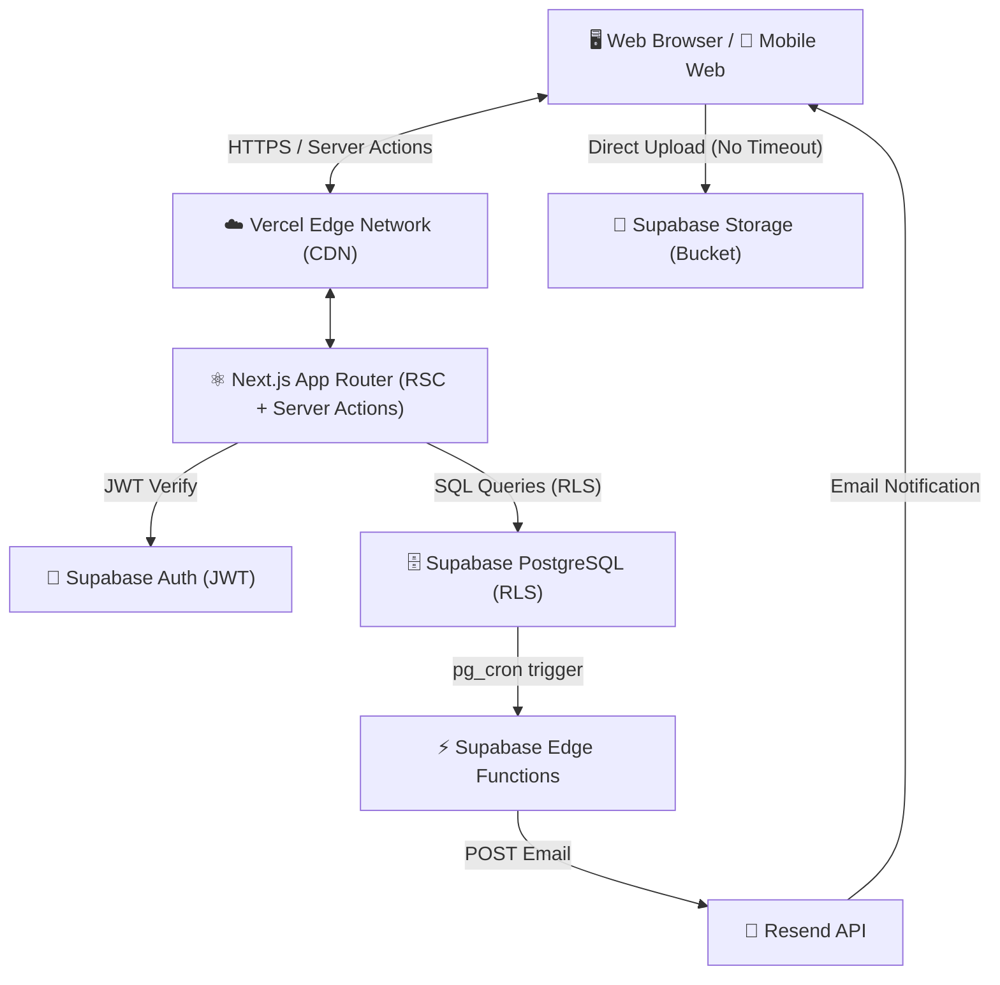
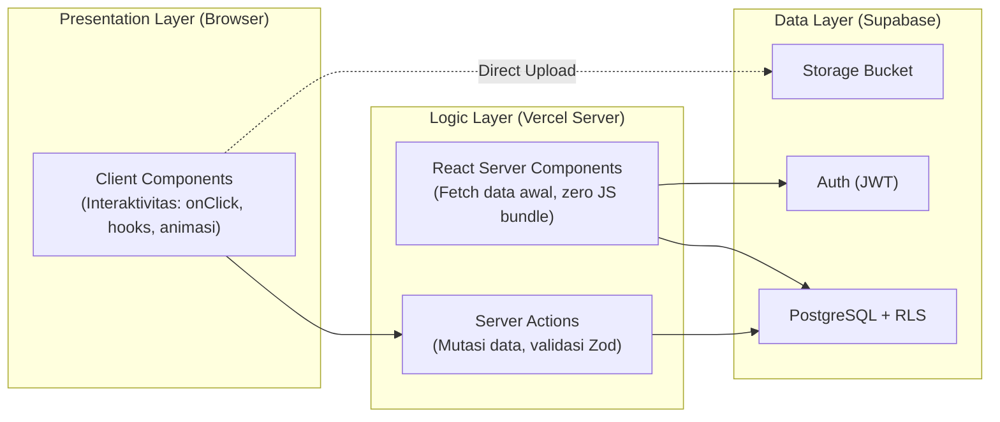
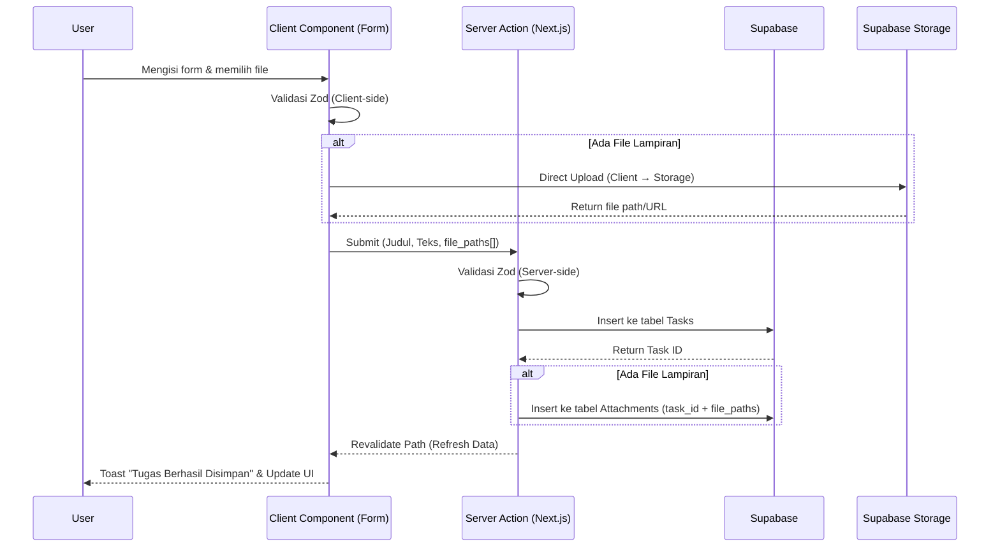
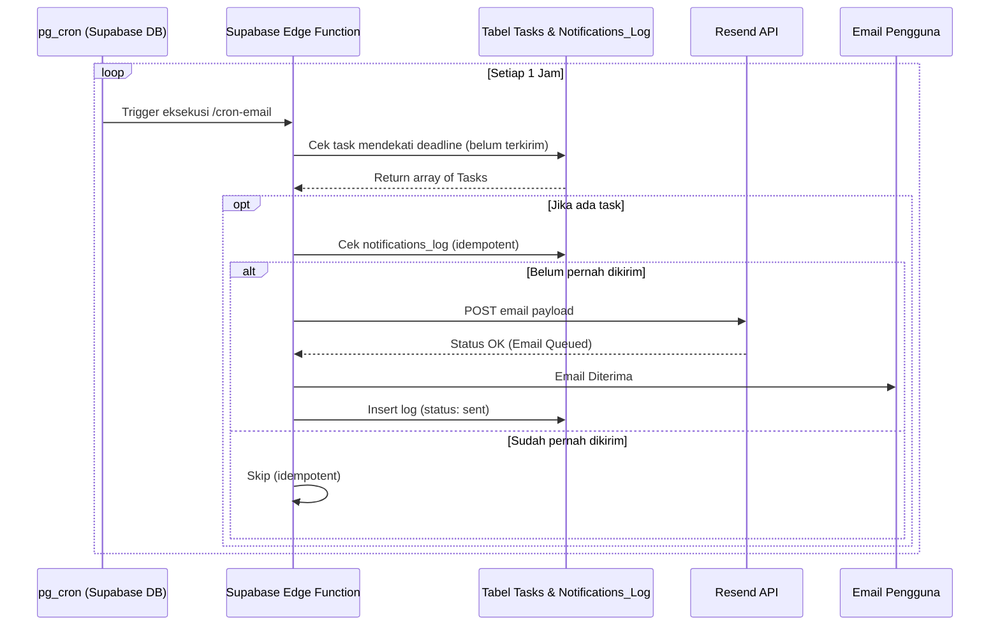
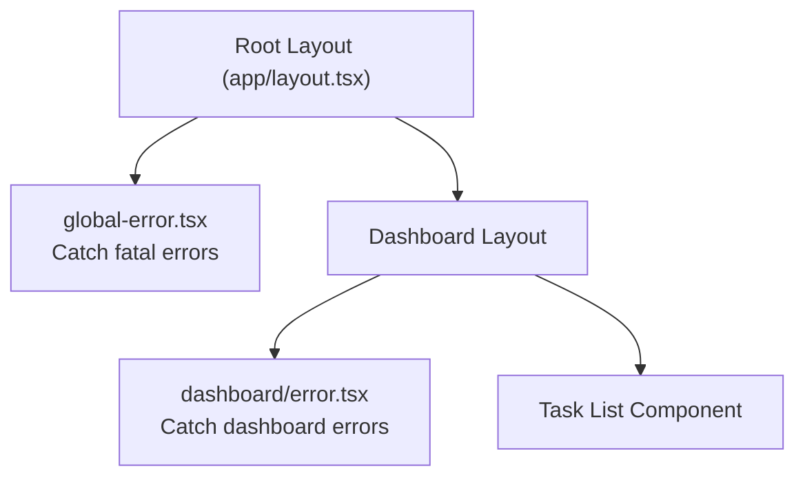

# Software Architecture (Project BesokAja)

## 1. High Level Architecture

Project BesokAja mengadopsi arsitektur *Serverless*, yang berarti tidak ada server konvensional (VPS) yang perlu dikelola secara konstan. Semua beban komputasi didistribusikan ke Vercel (Frontend & Serverless Functions) dan Supabase (Database, Auth, Storage, Edge Functions).



> **Catatan Penting:** Upload file dilakukan **langsung dari Client ke Supabase Storage** (bukan melalui Vercel), menghindari timeout 10 detik pada Vercel Free Tier.

---

## 2. Layer Architecture (Next.js App Router)

Aplikasi memisahkan *Client Components* dan *Server Components* secara tegas untuk performa optimal dan pengalaman yang **responsif tanpa lag** di handphone maupun desktop.



- **Data Layer:** Supabase Database dengan Row Level Security (RLS). Tidak ada API terpisah yang meng-koneksikan DB ke *client* selain *Server Actions* Next.js.
- **Logic Layer (Backend):** *Server Actions* di Next.js menangani validasi (*Zod*) dan mutasi data (CRUD) di sisi server sebelum men-generate UI.
- **Presentation Layer (Frontend):** *React Server Components* (RSC) untuk mengambil data awal dengan sangat cepat (zero client-side JS), digabung dengan *Client Components* (hanya jika membutuhkan interaktivitas seperti *hooks*, *onClick*, atau animasi).
- **Background Task Layer:** Supabase `pg_cron` secara periodik men-*trigger* Supabase Edge Functions. Ini memisahkan beban *background cron* dari Next.js sepenuhnya, menghindari batasan limit *timeout* Vercel (10 detik pada free tier).

---

## 3. Folder Structure (Aktual & Terencana)

```text
d:\Projeck\
├── app/
│   ├── globals.css              ✅ Design tokens (Rose/Peach palette)
│   ├── layout.tsx               ✅ Root layout (Baloo 2 + Inter fonts)
│   ├── page.tsx                 🔨 Landing page (perlu dibangun)
│   ├── login/
│   │   ├── page.tsx             ✅ Halaman login (Magic Link + Google)
│   │   └── actions.ts           ✅ Server Actions (loginWithMagicLink, loginWithGoogle)
│   ├── auth/
│   │   ├── callback/            ✅ OAuth callback handler
│   │   └── confirm/
│   │       └── route.ts         ✅ Magic Link verification
│   ├── dashboard/               🔨 (Belum dibuat — MVP Sprint 3)
│   │   ├── page.tsx             📋 Dashboard utama + task list
│   │   └── loading.tsx          📋 Skeleton loader
│   └── api/                     📋 (Jika diperlukan untuk webhooks)
├── components/
│   ├── ui/
│   │   ├── button.tsx           ✅ shadcn Button (perlu Clay override)
│   │   ├── input.tsx            ✅ shadcn Input
│   │   └── toast.tsx            ✅ shadcn Toast
│   ├── tasks/                   🔨 (Belum dibuat)
│   │   ├── task-card.tsx        📋 TaskCard component
│   │   ├── task-form.tsx        📋 Modal form pembuatan tugas
│   │   └── task-list.tsx        📋 Dashboard list container
│   └── shared/                  🔨 (Belum dibuat)
│       ├── navbar.tsx           📋 Top navigation bar
│       └── sidebar.tsx          📋 Sidebar navigasi (desktop)
├── lib/
│   ├── utils.ts                 ✅ cn() utility (clsx + tailwind-merge)
│   ├── validations.ts           📋 Skema Zod (belum dibuat)
│   └── actions/                 📋 Server Actions CRUD (belum dibuat)
│       └── tasks.ts             📋 createTask, updateTask, softDeleteTask
├── utils/
│   └── supabase/
│       ├── client.ts            📋 Supabase Browser Client
│       ├── server.ts            ✅ Supabase Server Client (SSR)
│       └── middleware.ts        ✅ Session refresh middleware
├── supabase/
│   ├── schema.sql               ✅ Skema DB lengkap + RLS + Triggers
│   ├── migrations/              📋 (Belum dibuat)
│   └── functions/               📋 Edge Function notifikasi (belum dibuat)
├── public/                      📋 Static assets
├── middleware.ts                ✅ Auth session middleware
├── package.json                 ✅ Dependencies configured
├── tsconfig.json                ✅ TypeScript config
└── Project_Documentation/       ✅ Dokumentasi lengkap (21 file)

Legend: ✅ Sudah ada  |  🔨 Perlu dibangun  |  📋 Direncanakan
```

---

## 4. Data Flow: Task Creation



---

## 5. Notification Flow (Automated Email)

Penggunaan Supabase native `pg_cron` jauh lebih andal dan murah dibandingkan Vercel Cron untuk penggunaan gratis/startup.



---

## 6. Performance & Responsiveness Architecture

### Strategi Anti-Lag

| Teknik | Penjelasan | Dampak |
|---|---|---|
| **React Server Components** | Data di-fetch di server, zero JS dikirim ke browser untuk komponen statis | Mengurangi bundle size 40-60% |
| **Streaming SSR** | Halaman di-render bertahap (streaming) — user melihat layout + skeleton, lalu data muncul | TTI < 1.5 detik |
| **Code Splitting** | Setiap route hanya memuat JS yang dibutuhkan (otomatis oleh Next.js App Router) | Bundle per-page < 100KB |
| **Lazy Load Modal** | `TaskForm` dan `FileDropzone` di-import dengan `React.lazy()` | Tidak membebani initial load |
| **Optimistic Updates** | UI berubah sebelum server merespons (checkbox, status change) | UX terasa instan |
| **Edge Caching (Vercel)** | Aset statis (font, gambar, CSS) di-cache di CDN terdekat | Load time < 500ms untuk aset |
| **Direct Client Upload** | File upload langsung ke Supabase (bukan via Vercel) | Zero timeout risk |
| **Database Indexes** | Index pada `user_id`, `deadline`, `task_id+notification_type` | Query < 50ms pada 10k+ rows |

### Responsive Breakpoints

```text
Mobile:        320px – 639px    → Stack layout, clay-sm shadows, reduced padding
Tablet:        640px – 1023px   → 2-column grid, standard clay shadows
Desktop:       1024px – 1279px  → Sidebar + main content, full clay effects
Wide Desktop:  1280px+          → Max-width container, spacious layout
```

### Performance Budget

| Metrik | Target | Alat Ukur |
|---|---|---|
| **Time to Interactive (TTI)** | < 1.5 detik (P90) | Lighthouse |
| **First Contentful Paint (FCP)** | < 1.0 detik | Lighthouse |
| **Largest Contentful Paint (LCP)** | < 2.0 detik | Lighthouse |
| **Cumulative Layout Shift (CLS)** | < 0.1 | Lighthouse |
| **Total JS Bundle (per page)** | < 150KB (gzipped) | webpack-bundle-analyzer |
| **Lighthouse Score** | ≥ 90 (Perf, A11y, SEO) | Lighthouse |

---

## 7. Error Boundary Strategy



- **`global-error.tsx`**: Menangkap error fatal yang merusak seluruh aplikasi. Menampilkan halaman "Terjadi kesalahan" dengan tombol "Coba Lagi".
- **`dashboard/error.tsx`**: Menangkap error pada halaman dashboard saja. Menampilkan pesan error dengan opsi retry tanpa menghapus sidebar/navbar.
- **`dashboard/loading.tsx`**: Menampilkan skeleton loader Claymorphism saat data sedang di-fetch (Suspense boundary).
- **Server Action errors**: Di-wrap dalam try-catch dan dikembalikan sebagai `{ success: false, error: string }` — ditampilkan via Toast di UI.

---

## 8. Justifikasi Pilihan Arsitektur (CTO Notes)

- **Kenapa bukan Vercel Cron?** Vercel Hobby tier hanya membolehkan 1 *cron job* per hari. Untuk pengingat H-1 atau H-3, pengecekan per jam jauh lebih presisi. Supabase memiliki `pg_cron` bawaan yang dapat menjalankan eksekusi lebih sering tanpa *upgrade* berbayar secara prematur.
- **Kenapa Server Actions (Next.js 14+)?** Mengurangi kerumitan pembuatan API route tradisional (REST) dan menghindari masalah state management global berkat kemampuan `revalidatePath()`.
- **Kenapa menggunakan Supabase Storage dan bukan S3?** Supabase Storage mempermudah konfigurasi RLS (Row Level Security), sehingga kita dapat menerapkan aturan bahwa *User* hanya dapat mengunduh berkas yang berhubungan dengan tugas milik mereka. Hal ini sulit dilakukan jika database dan file storage berada di provider terpisah.
- **Kenapa Mobile-First?** Target user utama (Mahasiswa) mengakses aplikasi terutama dari handphone. Desain yang responsif dan anti-lag di mobile bukan fitur tambahan, melainkan **kebutuhan inti**.
