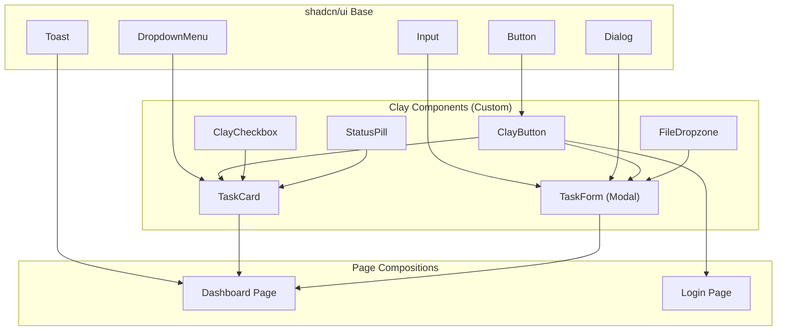

# UI Components Library (Project BesokAja)

Aplikasi dibangun di atas pondasi `shadcn/ui` (Radix UI + TailwindCSS) yang telah dimodifikasi (overridden) agar sesuai dengan desain **Claymorphism** dan palet warna **Rose/Peach/Snow White**. Pendekatan *headless UI* ini memastikan bahwa meskipun tampilannya kustom (bulat dan membal), elemen tetap memiliki standar aksesibilitas web (WAI-ARIA) yang sempurna.

Semua komponen harus **responsif** — bekerja dengan baik di handphone (≥ 320px) maupun desktop (≥ 1280px) tanpa lag atau glitch visual.

---

## 1. Daftar Komponen Inti

### `ClayButton`
Komponen tombol standar untuk tindakan utama.

- **Purpose:** Memulai mutasi data, submit form, dan navigasi (CTA).
- **Base:** Ekstensi dari `shadcn/ui Button` dengan override Claymorphism.

**Props Interface:**
```typescript
interface ClayButtonProps {
  variant: 'default' | 'danger' | 'success' | 'ghost' | 'outline';
  size: 'sm' | 'md' | 'lg' | 'icon';
  isLoading?: boolean;
  disabled?: boolean;
  children: React.ReactNode;
  onClick?: () => void;
  className?: string;
}
```

**State Visual:**

| State | Background | Shadow | Transform | Keterangan |
|---|---|---|---|---|
| **Idle** | `--primary` (#FD92AD) | `shadow-clay` | — | Default state |
| **Hover** | `--primary` (5% darker) | `shadow-clay-hover` | `translateY(-1px)` | Terangkat ringan |
| **Active** | `--primary` (10% darker) | `shadow-clay-inset` | `scale(0.97)` | Efek ditekan ke dalam |
| **Loading** | `--primary` (opacity 70%) | `shadow-clay` | — | Spinner icon, pointer-events: none |
| **Disabled** | `--muted` | *(none)* | — | Opacity 50%, cursor: not-allowed |

**Accessibility:** Didukung *focus-visible* dari Radix, kompatibel dengan *screen-reader*, aria-label wajib untuk `size='icon'`.

**Responsiveness:** Pada mobile (`< 768px`), `size='lg'` otomatis memenuhi lebar penuh (`w-full`).

**Usage Example:**
```tsx
<ClayButton variant="default" size="md" isLoading={isPending}>
  Simpan Tugas
</ClayButton>

<ClayButton variant="danger" size="icon" aria-label="Hapus tugas">
  <Trash2 className="w-4 h-4" />
</ClayButton>
```

---

### `TaskCard`
Komponen *card* spesifik untuk menampilkan suatu tugas.

- **Purpose:** Menyajikan ringkasan tugas (Judul, prioritas, jumlah lampiran, deadline, checkbox penyelesaian) di halaman *Dashboard*.

**Props Interface:**
```typescript
interface Task {
  id: string;
  title: string;
  description?: string;
  priority: 'Low' | 'Medium' | 'High';
  status: 'To-Do' | 'In Progress' | 'Done';
  deadline?: string; // ISO datetime
  category?: string;
  attachmentCount: number;
}

interface TaskCardProps {
  task: Task;
  onCheck: (id: string) => void;
  onClick: (id: string) => void;
  onDelete?: (id: string) => void;
}
```

**State Visual:**

| Kondisi | Background | Border Accent | Keterangan |
|---|---|---|---|
| **Normal** | `--card` (#FEFEFE) | — | Default state |
| **Priority High** | `--card` | Left border 4px `--priority-high` (#F0607A) | Garis merah di kiri |
| **Priority Medium** | `--card` | Left border 4px `--priority-medium` (#F5B830) | Garis amber di kiri |
| **Priority Low** | `--card` | Left border 4px `--priority-low` (#5CC9A0) | Garis mint di kiri |
| **Deadline < 24 jam** | `--priority-high` (opacity 5%) | Pulse animation | Tinted merah muda + ikon jam berdetak |
| **Done** | `--card` (opacity 60%) | — | Judul dicoret (strikethrough), opacity turun |

**Micro-Interactions:**
- Hover: kartu naik `translateY(-2px)` + shadow naik ke Level 3. Tombol *delete* dan *edit* muncul secara halus (`opacity 0 → 1`, `transition-smooth`).
- Touch (mobile): Efek press pada card — `shadow-clay-inset` sesaat saat ditekan.

**Responsiveness:**
- **Desktop (≥ 1024px):** Grid 2-3 kolom, kartu ukuran medium.
- **Tablet (≥ 768px):** Grid 2 kolom.
- **Mobile (< 768px):** Stack 1 kolom penuh, shadow dikurangi ke `shadow-clay-sm`, padding internal turun ke `space-4`.

---

### `ClayCheckbox`
Pengganti *input type checkbox* tradisional.

- **Purpose:** Menandai tugas sebagai selesai (*Done*).

**Props Interface:**
```typescript
interface ClayCheckboxProps {
  checked: boolean;
  onCheckedChange: (checked: boolean) => void;
  disabled?: boolean;
  label?: string;
  id: string;
}
```

**State Visual:**
- **Unchecked:** Background `--card`, `shadow-clay-sm` (extruded, menonjol keluar).
- **Checked:** Background `--success` (#5CC9A0 Mint Sage), `shadow-clay-inset` (tertekan ke dalam). Ikon ceklis putih.
- **Animation:** Saat ditekan, ikon cek membesar sesaat (`scale(1.2)` → `scale(1)`) dengan `transition-spring`, dan teks tugas di sebelahnya dicoret (strikethrough) secara animatif.

**Responsiveness:** Ukuran minimum touch target 44x44px sesuai WCAG 2.1 guideline.

---

### `FileDropzone`
Area seret dan lepas (*drag & drop*) untuk melampirkan berkas.

- **Purpose:** Menerima input berkas dari pengguna dengan pengalaman yang intuitif.

**Props Interface:**
```typescript
interface FileDropzoneProps {
  onFilesSelected: (files: File[]) => void;
  maxSizeMB?: number; // default: 5
  acceptedTypes?: string[]; // default: ['.pdf', '.docx', '.zip', '.png', '.jpg']
  maxFiles?: number; // default: 5
  isUploading?: boolean;
  uploadProgress?: number; // 0-100
}
```

**State Visual:**

| State | Tampilan | Shadow |
|---|---|---|
| **Idle** | Garis putus-putus `--border` tebal, ikon Upload, teks "Seret file atau klik di sini" | `shadow-clay-sm` |
| **DragActive** | Background berubah ke `--accent` (#FFB5C5), garis solid | `shadow-clay-inset` |
| **Uploading** | Progress bar horizontal dengan persentase | `shadow-clay` |
| **Error** | Teks merah `--destructive`, ikon peringatan | `shadow-clay` + red tint |
| **Success** | Daftar file terupload dengan ikon file type | `shadow-clay-sm` |

**Responsiveness:**
- Desktop: Area drag & drop yang besar (200px tinggi).
- Mobile: Area lebih kecil (120px), dengan tombol "Pilih File" yang lebih menonjol (karena drag & drop sulit di mobile).

---

### `StatusPill` / `Badge`
Penanda visual untuk prioritas dan status tugas.

- **Purpose:** Identifikasi visual cepat saat melakukan pemindaian (scanning) mata pada daftar tugas.

**Props Interface:**
```typescript
interface StatusPillProps {
  variant: 'high' | 'medium' | 'low' | 'todo' | 'in-progress' | 'done';
  children: React.ReactNode;
  size?: 'sm' | 'md';
}
```

**Variant Colors:**

| Variant | Background | Text Color | Contoh Label |
|---|---|---|---|
| `high` | `--priority-high` (15% opacity) | `--priority-high` | "Tinggi" |
| `medium` | `--priority-medium` (15% opacity) | `hsl(38, 70%, 35%)` | "Sedang" |
| `low` / `done` | `--priority-low` (15% opacity) | `hsl(155, 40%, 30%)` | "Rendah" / "Selesai" |
| `todo` | `--muted` | `--muted-foreground` | "To-Do" |
| `in-progress` | `--primary` (15% opacity) | `--primary` | "Dikerjakan" |

**Styling:** Berbentuk elips sempurna (`rounded-full`), padding horizontal `space-3`, font `text-caption` (12px), font-weight 600.

---

### `Toast` / `Snackbar`
Notifikasi mengambang (floating).

- **Purpose:** Memberikan umpan balik instan atas suatu operasi (e.g. "Tugas Berhasil Disimpan").

**Variant:**

| Variant | Ikon | Background | Keterangan |
|---|---|---|---|
| `success` | ✅ CheckCircle | `--success` | "Tugas berhasil disimpan" |
| `error` | ❌ XCircle | `--destructive` | "Gagal menyimpan tugas" |
| `info` | ℹ️ Info | `--primary` | "Magic Link terkirim ke email Anda" |
| `warning` | ⚠️ AlertTriangle | `--priority-medium` | "File melebihi batas ukuran" |

**Animasi:** Muncul dari bagian bawah ke tengah (Slide Up), memiliki bayangan tebal `shadow-clay-modal`. Otomatis hilang dalam 3 detik, kecuali kursor berada di atasnya (pause on hover). Menggunakan `transition-spring` untuk efek bounce.

---

## 2. Component Dependency Tree



---

## 3. Aturan Penggunaan Komponen (Component Rules)

### Visual Rules
- **Hindari Elemen Datar:** Jika sebuah elemen dirancang untuk dapat diklik (interaktif), ia **wajib** memiliki volume visual (shadow 3D/Clay). Elemen yang benar-benar rata (flat) secara psikologis mengisyaratkan bahwa itu hanyalah teks atau elemen pasif.
- **Konsistensi Radius:** Semua komponen (bahkan input *text field*) wajib menggunakan radius sudut minimal `1rem` (16px) hingga `2rem` (32px) agar tema membulatnya tidak rusak oleh sudut tajam yang tiba-tiba.
- **Aksesibilitas Warna (Contrast):** Jika menggunakan `variant='danger'` (warna latar belakang merah), teks di dalamnya harus tetap jelas (seperti *dark rosewood* `#3D2C2E`), jangan memaksa teks berwarna putih jika tidak memenuhi skor kontras WCAG 2.1 (AA).

### Performance Rules (Anti-Lag)
- **Lazy Load komponen berat:** `FileDropzone` dan `TaskForm` (modal) wajib di-*lazy load* menggunakan `React.lazy()` + `Suspense` agar tidak membebani *initial bundle*.
- **Virtualized List:** Jika jumlah tugas > 50 di dashboard, gunakan *windowing* (misal `react-window`) agar DOM tidak membengkak dan scroll tetap mulus 60fps.
- **Optimistic Updates:** Saat user mencentang checkbox (Done), UI harus langsung berubah *sebelum* Server Action selesai. Jika gagal, revert dengan toast error.
- **Image/File Lazy Loading:** Preview thumbnail lampiran menggunakan `loading="lazy"` native browser.

### Responsive Rules
- **Mobile Touch Target:** Semua elemen interaktif minimum 44x44px (WCAG 2.1 Level AAA).
- **No Horizontal Scroll:** Tidak boleh ada horizontal overflow di viewport manapun.
- **Font Scaling:** Gunakan `rem` / `em`, bukan `px` hardcoded, untuk mendukung user yang memperbesar font browser.
- **Safe Area:** Pada mobile, hormati `env(safe-area-inset-*)` untuk device dengan notch.
