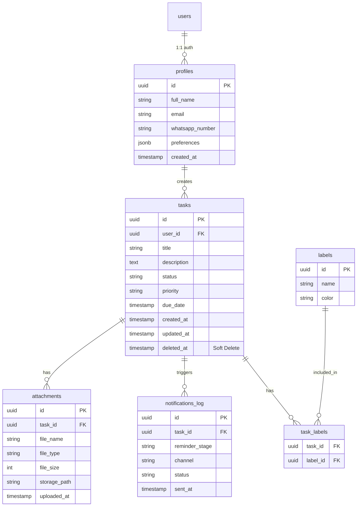

# Database Architecture & Skema (Project OUTBREAK)

Sistem menggunakan PostgreSQL (disediakan oleh Supabase) yang memungkinkan relasi antar-entitas secara terstruktur (ACID compliant). Semua tabel dikonfigurasi dengan fitur *Row Level Security (RLS)*. 

## 1. Entity Relationship Diagram (ERD)



## 2. Struktur Tabel & Kolom

### A. Tabel `profiles`
Menyimpan data pengguna di luar kredensial keamanan. Dibuat secara otomatis melalui *Trigger* saat pengguna baru mendaftar di Supabase Auth (`auth.users`).
- `id` (uuid, PK, relasi langsung ke `auth.users.id`)
- `full_name` (text, nullable)
- `email` (text, unique)
- `whatsapp_number` (text, nullable, untuk fase berikutnya)
- `preferences` (jsonb, default: `{"email_reminders": true}`)

### B. Tabel `tasks`
- `id` (uuid, PK, default `uuid_generate_v4()`)
- `user_id` (uuid, FK ke `profiles.id`)
- `title` (text, Not Null)
- `description` (text)
- `status` (text, Not Null, cek: `To-Do`, `In Progress`, `Done`, `Archived`)
- `priority` (text, Not Null, cek: `Low`, `Medium`, `High`)
- `due_date` (timestamptz, Not Null)
- `deleted_at` (timestamptz) - *Implementasi Soft Delete*

### C. Tabel `attachments`
Memisahkan berkas dari *tasks* agar rasio relasinya adalah 1:N (satu tugas dapat menampung banyak file pendukung).
- `id` (uuid, PK)
- `task_id` (uuid, FK ke `tasks.id`, On Delete Cascade)
- `file_name` (text, Not Null)
- `file_type` (text)
- `file_size` (integer, limit 5MB dalam byte)
- `storage_path` (text, lokasi unik di Supabase Storage Bucket)

### D. Tabel Pivot `task_labels` & `labels`
Digunakan untuk klasifikasi tugas (misal: "Kampus", "Penting").
- **labels**: `id`, `name`, `color`
- **task_labels**: `task_id` (FK), `label_id` (FK) — Primary Key gabungan (Composite PK).

### E. Tabel `notifications_log` (Pencegahan Duplikasi)
Mencatat *reminder* apa yang sudah dikirim untuk mencegah pengguna dibombardir dengan email ganda dari *cron job* yang sama.
- `id` (uuid, PK)
- `task_id` (uuid, FK ke `tasks.id`)
- `reminder_stage` (text, contoh: `H-3`, `H-1`, `H-0`)
- `channel` (text, contoh: `email`)
- `status` (text, `sent`, `failed`)
- `sent_at` (timestamptz)

## 3. Row Level Security (RLS) Policies
Menerapkan isolasi multitenancy di mana tiap user hanya mengakses tabel miliknya sendiri.

**Contoh RLS Policy pada tabel `tasks`:**
```sql
-- Mengaktifkan RLS
ALTER TABLE tasks ENABLE ROW LEVEL SECURITY;

-- Policy untuk membaca (SELECT)
CREATE POLICY "Users can view their own tasks"
ON tasks FOR SELECT
USING (auth.uid() = user_id);

-- Policy untuk membuat (INSERT)
CREATE POLICY "Users can create tasks"
ON tasks FOR INSERT
WITH CHECK (auth.uid() = user_id);

-- Policy untuk update (UPDATE)
CREATE POLICY "Users can update their own tasks"
ON tasks FOR UPDATE
USING (auth.uid() = user_id);
```

## 4. Query Optimization & Indexes
Untuk memastikan performa tidak menurun saat data mencapai >10.000 row, indeks spesifik akan ditambahkan pada query yang paling sering dipanggil:
- `CREATE INDEX idx_tasks_user_id ON tasks(user_id);` (Mempercepat query saat *fetch dashboard*)
- `CREATE INDEX idx_tasks_due_date ON tasks(due_date) WHERE status != 'Done';` (Mempercepat *Cron Job* pencarian email yang jatuh tempo)
- `CREATE INDEX idx_notifications_log_task_stage ON notifications_log(task_id, reminder_stage);` (Mempercepat validasi *idempotent* duplikasi)
