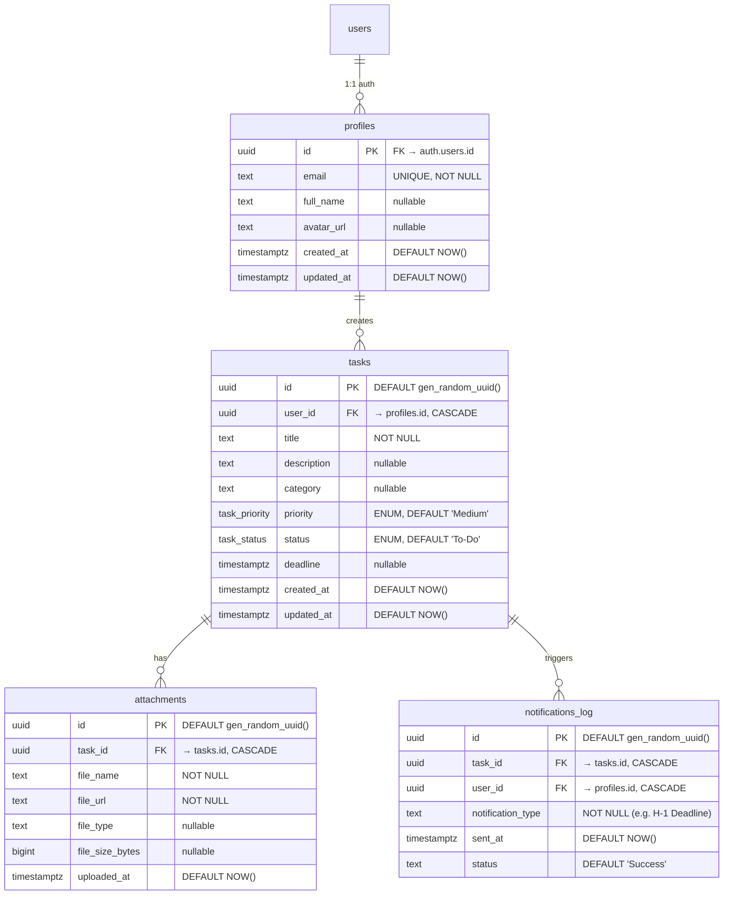

# Database Architecture & Skema (Project BesokAja)

Sistem menggunakan PostgreSQL (disediakan oleh Supabase) yang memungkinkan relasi antar-entitas secara terstruktur (ACID compliant). Semua tabel dikonfigurasi dengan fitur *Row Level Security (RLS)*.

---

## 1. Entity Relationship Diagram (ERD)



> **Catatan Evolusi ERD:** Tabel `labels` dan `task_labels` (many-to-many) direncanakan untuk **Phase 2**. Pada MVP, pengelompokan tugas cukup menggunakan kolom `category` (text) di tabel `tasks`. Arsitektur ini memungkinkan migrasi bertahap tanpa memecah skema yang sudah berjalan.

---

## 2. Data Dictionary (Struktur Tabel & Kolom Detail)

### A. Tabel `profiles`
Menyimpan data pengguna di luar kredensial keamanan. Dibuat secara otomatis melalui *Trigger* saat pengguna baru mendaftar di Supabase Auth (`auth.users`).

| Kolom | Tipe Data | Constraint | Default | Deskripsi |
|---|---|---|---|---|
| `id` | `uuid` | PK, FK → `auth.users.id`, ON DELETE CASCADE | — | ID unik pengguna |
| `email` | `text` | UNIQUE, NOT NULL | — | Alamat email pengguna |
| `full_name` | `text` | nullable | `NULL` | Nama lengkap pengguna |
| `avatar_url` | `text` | nullable | `NULL` | URL foto profil (dari OAuth) |
| `created_at` | `timestamptz` | NOT NULL | `NOW()` | Waktu pendaftaran |
| `updated_at` | `timestamptz` | NOT NULL | `NOW()` | Diperbarui via trigger |

### B. Tabel `tasks`
Tabel sentral untuk penyimpanan tugas pengguna.

| Kolom | Tipe Data | Constraint | Default | Deskripsi |
|---|---|---|---|---|
| `id` | `uuid` | PK | `gen_random_uuid()` | ID unik tugas |
| `user_id` | `uuid` | FK → `profiles.id`, ON DELETE CASCADE, NOT NULL | — | Pemilik tugas |
| `title` | `text` | NOT NULL | — | Judul tugas (min 3 karakter, divalidasi Zod) |
| `description` | `text` | nullable | `NULL` | Deskripsi/catatan tugas |
| `category` | `text` | nullable | `NULL` | Kategori sederhana (MVP), migrasi ke tabel `labels` di Phase 2 |
| `priority` | `task_priority` (ENUM) | NOT NULL | `'Medium'` | Nilai: `Low`, `Medium`, `High` |
| `status` | `task_status` (ENUM) | NOT NULL | `'To-Do'` | Nilai: `To-Do`, `In Progress`, `Done` |
| `deadline` | `timestamptz` | nullable | `NULL` | Batas waktu penyelesaian |
| `created_at` | `timestamptz` | NOT NULL | `NOW()` | Waktu pembuatan |
| `updated_at` | `timestamptz` | NOT NULL | `NOW()` | Diperbarui via trigger |

> **Rencana Evolusi (Phase 2):** Kolom `deleted_at` (timestamptz, nullable) akan ditambahkan untuk implementasi **Soft Delete** / Recycle Bin. Query dashboard akan difilter dengan `WHERE deleted_at IS NULL`. Tugas yang terhapus > 30 hari akan di-hard-delete oleh cron cleanup.

### C. Tabel `attachments`
Memisahkan berkas dari *tasks* agar rasio relasinya adalah 1:N (satu tugas dapat menampung banyak file pendukung).

| Kolom | Tipe Data | Constraint | Default | Deskripsi |
|---|---|---|---|---|
| `id` | `uuid` | PK | `gen_random_uuid()` | ID unik lampiran |
| `task_id` | `uuid` | FK → `tasks.id`, ON DELETE CASCADE, NOT NULL | — | Tugas induk |
| `file_name` | `text` | NOT NULL | — | Nama file asli |
| `file_url` | `text` | NOT NULL | — | Path/URL di Supabase Storage |
| `file_type` | `text` | nullable | `NULL` | MIME type (e.g. `application/pdf`) |
| `file_size_bytes` | `bigint` | nullable | `NULL` | Ukuran file dalam bytes (limit 5MB = 5242880) |
| `uploaded_at` | `timestamptz` | NOT NULL | `NOW()` | Waktu upload |

### D. Tabel `notifications_log` (Pencegahan Duplikasi)
Mencatat *reminder* apa yang sudah dikirim untuk mencegah pengguna dibombardir dengan email ganda dari *cron job* yang sama.

| Kolom | Tipe Data | Constraint | Default | Deskripsi |
|---|---|---|---|---|
| `id` | `uuid` | PK | `gen_random_uuid()` | ID unik log |
| `task_id` | `uuid` | FK → `tasks.id`, ON DELETE CASCADE, NOT NULL | — | Tugas terkait |
| `user_id` | `uuid` | FK → `profiles.id`, ON DELETE CASCADE, NOT NULL | — | Pemilik tugas |
| `notification_type` | `text` | NOT NULL | — | Tahap pengingat (e.g. `H-3`, `H-1`, `H-0`) |
| `sent_at` | `timestamptz` | NOT NULL | `NOW()` | Waktu pengiriman |
| `status` | `text` | — | `'Success'` | Status: `Success`, `Failed` |

### E. Tabel `labels` & `task_labels` *(Planned — Phase 2)*
Digunakan untuk klasifikasi tugas multi-label.

```sql
-- Phase 2 Migration Script (BELUM dieksekusi)
CREATE TABLE public.labels (
  id UUID DEFAULT gen_random_uuid() PRIMARY KEY,
  user_id UUID REFERENCES public.profiles(id) ON DELETE CASCADE NOT NULL,
  name TEXT NOT NULL,
  color TEXT DEFAULT '#FFB5C5'
);

CREATE TABLE public.task_labels (
  task_id UUID REFERENCES public.tasks(id) ON DELETE CASCADE,
  label_id UUID REFERENCES public.labels(id) ON DELETE CASCADE,
  PRIMARY KEY (task_id, label_id)
);
```

---

## 3. Custom Types (PostgreSQL ENUM)

```sql
-- Sudah ada di schema.sql
CREATE TYPE task_priority AS ENUM ('Low', 'Medium', 'High');
CREATE TYPE task_status AS ENUM ('To-Do', 'In Progress', 'Done');
```

> **Catatan Evolusi:** Jika perlu menambah nilai enum di masa depan (misal status `Archived`), gunakan `ALTER TYPE task_status ADD VALUE 'Archived';`. PostgreSQL ENUM tidak mendukung penghapusan nilai, jadi pilih dengan hati-hati.

---

## 4. Row Level Security (RLS) Policies

Menerapkan isolasi multitenancy di mana tiap user hanya mengakses tabel miliknya sendiri.

### Policies pada `profiles`
```sql
ALTER TABLE public.profiles ENABLE ROW LEVEL SECURITY;

CREATE POLICY "Users can view own profile"
ON public.profiles FOR SELECT
USING (auth.uid() = id);

CREATE POLICY "Users can update own profile"
ON public.profiles FOR UPDATE
USING (auth.uid() = id);
```

### Policies pada `tasks`
```sql
ALTER TABLE public.tasks ENABLE ROW LEVEL SECURITY;

-- Single policy untuk semua operasi CRUD
CREATE POLICY "Users can manage their own tasks"
ON public.tasks FOR ALL
USING (auth.uid() = user_id);
```

### Policies pada `attachments`
```sql
ALTER TABLE public.attachments ENABLE ROW LEVEL SECURITY;

-- Cek kepemilikan melalui relasi task → user
CREATE POLICY "Users can manage attachments of their tasks"
ON public.attachments FOR ALL
USING (
  EXISTS (
    SELECT 1 FROM public.tasks
    WHERE public.tasks.id = public.attachments.task_id
    AND public.tasks.user_id = auth.uid()
  )
);
```

### Policies pada `notifications_log`
```sql
ALTER TABLE public.notifications_log ENABLE ROW LEVEL SECURITY;

CREATE POLICY "Users can view own notifications"
ON public.notifications_log FOR SELECT
USING (auth.uid() = user_id);
```

---

## 5. Triggers & Functions

### Auto-Update `updated_at`
```sql
CREATE OR REPLACE FUNCTION update_modified_column()
RETURNS TRIGGER AS $$
BEGIN
   NEW.updated_at = NOW();
   RETURN NEW;
END;
$$ LANGUAGE plpgsql;

CREATE TRIGGER set_timestamp_profiles
BEFORE UPDATE ON public.profiles
FOR EACH ROW EXECUTE PROCEDURE update_modified_column();

CREATE TRIGGER set_timestamp_tasks
BEFORE UPDATE ON public.tasks
FOR EACH ROW EXECUTE PROCEDURE update_modified_column();
```

### Auto-Create Profile on Sign Up
```sql
CREATE OR REPLACE FUNCTION public.handle_new_user()
RETURNS TRIGGER AS $$
BEGIN
  INSERT INTO public.profiles (id, email, full_name, avatar_url)
  VALUES (
    NEW.id,
    NEW.email,
    NEW.raw_user_meta_data->>'full_name',
    NEW.raw_user_meta_data->>'avatar_url'
  );
  RETURN NEW;
END;
$$ LANGUAGE plpgsql SECURITY DEFINER;

CREATE TRIGGER on_auth_user_created
  AFTER INSERT ON auth.users
  FOR EACH ROW EXECUTE PROCEDURE public.handle_new_user();
```

---

## 6. Query Optimization & Indexes

Untuk memastikan performa tidak menurun saat data mencapai >10.000 row, indeks spesifik akan ditambahkan pada query yang paling sering dipanggil:

```sql
-- Mempercepat query saat fetch dashboard (filter by user)
CREATE INDEX idx_tasks_user_id ON tasks(user_id);

-- Mempercepat Cron Job pencarian tugas mendekati deadline
CREATE INDEX idx_tasks_due_date ON tasks(deadline)
  WHERE status != 'Done';

-- Mempercepat validasi idempotent duplikasi notifikasi
CREATE INDEX idx_notifications_log_task_type
  ON notifications_log(task_id, notification_type);

-- Mempercepat fetch lampiran per tugas
CREATE INDEX idx_attachments_task_id ON attachments(task_id);
```

---

## 7. Migration Strategy

### Alur Migrasi Database
1. **Development:** Perubahan skema ditulis sebagai file SQL di `supabase/migrations/`.
2. **Testing:** Dijalankan di Supabase lokal (`npx supabase db reset`) sebelum di-push.
3. **Production:** Dijalankan melalui Supabase Dashboard SQL Editor atau `supabase db push`.

### Naming Convention Migrasi
```
supabase/migrations/
├── 20260701000000_initial_schema.sql      # Skema awal (profiles, tasks, attachments, notifications)
├── 20260801000000_add_soft_delete.sql     # Phase 2: Kolom deleted_at
├── 20260801000001_add_labels_system.sql   # Phase 2: Tabel labels & task_labels
└── 20260901000000_add_audit_log.sql       # Phase 3: Tabel activity_logs
```

---

## 8. Seed Data (Development & Testing)

```sql
-- Contoh data untuk development
-- (Hanya dijalankan di lingkungan lokal, JANGAN di production)

-- Catatan: user_id harus sesuai dengan auth.users yang ada
-- Gunakan Supabase Dashboard untuk membuat user test terlebih dahulu

INSERT INTO public.tasks (user_id, title, description, category, priority, status, deadline)
VALUES
  ('USER_UUID_HERE', 'Kumpul Laporan Praktikum', 'Laporan praktikum mata kuliah Basis Data', 'Kuliah', 'High', 'To-Do', NOW() + INTERVAL '1 day'),
  ('USER_UUID_HERE', 'Revisi Desain Logo', 'Brief dari Klien ABC sudah diterima', 'Freelance', 'Medium', 'In Progress', NOW() + INTERVAL '3 days'),
  ('USER_UUID_HERE', 'Beli Buku Referensi', NULL, 'Personal', 'Low', 'To-Do', NOW() + INTERVAL '7 days');
```
