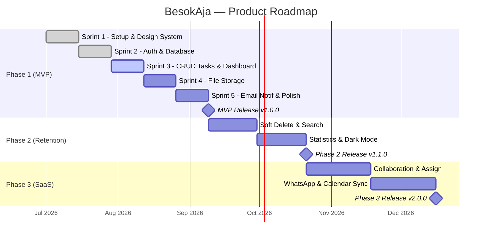

# Project Roadmap & Prioritization

## Strategi Prioritisasi (MoSCoW & Impact vs Effort)
Dalam membangun produk tingkat Enterprise yang dapat dirawat oleh satu *developer*, manajemen ruang lingkup (*scope*) adalah prioritas mutlak. Kita menggunakan pendekatan MoSCoW (*Must Have, Should Have, Could Have, Won't Have*) digabung dengan analisis *Impact vs Effort*.

---

### ✅ Phase 1: Minimum Viable Product (MVP) — Bulan 1-2

**Fokus:** Fondasi Aplikasi, Manajemen Tugas Inti, *Storage*, dan Automasi Dasar.
**Target:** Aplikasi fungsional yang bisa digunakan untuk produktivitas personal.

| Fitur | Status | Sprint |
|---|---|---|
| Otentikasi Pengguna (Supabase Auth — Email/Magic Link & Google) | ✅ Done | Sprint 2 |
| Skema Database + Row Level Security (RLS) | ✅ Done | Sprint 2 |
| Design System Claymorphism (Palet Rose/Peach/Snow White) | ✅ Done | Sprint 1 |
| Root Layout + Auth Middleware | ✅ Done | Sprint 1-2 |
| CRUD Tugas (Judul, Deskripsi, Kategori, Prioritas, Deadline) | ⬜ In Progress | Sprint 3 |
| Dashboard Responsif (Mobile + Desktop) | ⬜ In Progress | Sprint 3 |
| Upload & Download File (Supabase Storage, Limit 5MB) | ⬜ To-Do | Sprint 4 |
| Email Notification System (pg_cron + Edge Function + Resend) | ⬜ To-Do | Sprint 5 |
| Responsive UI Polish + Performance Audit (Lighthouse ≥ 90) | ⬜ To-Do | Sprint 5 |

**Release Criteria Phase 1:**
- [ ] Pengguna bisa login, buat tugas, upload file, dan menerima email reminder.
- [ ] Lighthouse Performance ≥ 90 di mobile dan desktop.
- [ ] Responsif sempurna di viewport 375px (iPhone SE) sampai 1440px (desktop).
- [ ] Zero critical bugs, zero data leakage antar user.
- [ ] Build sukses (`npm run build`) tanpa error.

---

### 🚀 Phase 2: Produktivitas Lanjutan & Retensi — Bulan 3-4

**Fokus:** Memperbaiki retensi (*retention*) melalui *user experience* dan wawasan produktivitas.

| Fitur | Prioritas | Effort |
|---|---|---|
| Recycle Bin / Soft Delete (`deleted_at` column) | Must Have | Rendah |
| Sub-task / Checklist di dalam tugas | Should Have | Sedang |
| Dashboard Statistik (Grafik tugas selesai vs terlambat) | Should Have | Sedang |
| Pencarian Global (Global Search) dengan filter | Should Have | Sedang |
| Mode Gelap (Dark Mode) UI toggle | Could Have | Rendah |
| Export Data (PDF/Excel) | Could Have | Sedang |
| Audit Log (Activity Timeline) | Could Have | Rendah |
| Pomodoro Timer Terintegrasi | Could Have | Sedang |

**Release Criteria Phase 2:**
- [ ] Dark Mode toggle berfungsi dan palet Clay tetap konsisten.
- [ ] Pencarian global menemukan tugas < 200ms.
- [ ] Soft Delete berfungsi — tugas terhapus bisa di-restore dalam 30 hari.

---

### 🌟 Phase 3: Skalabilitas & Kolaborasi (SaaS Ready) — Bulan 5-6

**Fokus:** Monetisasi, kerja sama tim, dan opsi *enterprise*.

| Fitur | Prioritas | Effort |
|---|---|---|
| Sinkronisasi dengan Google Calendar | Should Have | Tinggi |
| Pendelegasian (Assign) tugas antar pengguna | Must Have (SaaS) | Sangat Tinggi |
| Notifikasi WhatsApp (via API Resmi/Fontte/Wablas) | Should Have | Sangat Tinggi |
| Tugas Berulang (Recurring Tasks) | Could Have | Sedang |
| Log Audit Aktivitas Pengguna (Audit Trail) | Should Have | Rendah |

---

### 🔮 Future Vision (AI & Automasi Lanjutan)

**Fokus:** Mengubah alat menjadi asisten pintar.

- [ ] **AI Smart Reminder:** AI menentukan waktu terbaik mengirim email berdasarkan pola buka (*open rate*) tiap *user*.
- [ ] **AI Weekly Summary:** Ringkasan produktivitas yang di-*generate* menggunakan LLM.
- [ ] **Natural Language Task Creation:** ("Ingatkan saya presentasi laporan keuangan minggu depan jam 9 pagi beserta file laporan.pdf").
- [ ] **Gamification:** Experience Points, Health Bar, Achievements untuk motivasi.

---

## Sprint Timeline (Gantt Chart)

---

## Sprint Planning (Phase 1 — Detail)

| Sprint | Durasi | Fokus | Output |
|---|---|---|---|
| **Sprint 1** | Minggu 1 | Inisialisasi Repo, Next.js, Supabase, TailwindCSS, shadcn/ui, Design System Clay | Repo + Layout + CSS tokens |
| **Sprint 2** | Minggu 2 | Auth (Login/Register), Skema DB, RLS, Trigger `handle_new_user` | Login page + DB ready |
| **Sprint 3** | Minggu 3-4 | CRUD Tasks, Dashboard responsif, TaskCard, TaskForm, Optimistic Updates | Dashboard fungsional |
| **Sprint 4** | Minggu 5 | Storage Bucket, FileDropzone, Direct Upload, Signed URL Download | File management |
| **Sprint 5** | Minggu 6 | Edge Function Email, pg_cron, Responsive Polish, Performance Audit | **MVP Ready 🚀** |
