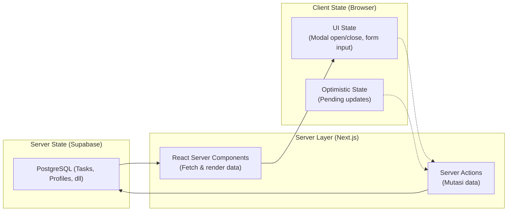

# State Management Strategy (Project BesokAja)

Dokumen ini menjelaskan bagaimana data dan state dikelola di seluruh lapisan aplikasi untuk menjamin performa yang **anti-lag** di mobile maupun desktop.

---

## 1. Prinsip Utama

BesokAja menggunakan pendekatan **Server-First State Management** — ini berarti mayoritas state (data tugas, profil, lampiran) hidup di server dan database, bukan di memori browser. Ini menghindari *state synchronization hell* yang sering menyebabkan bug dan lag.



---

## 2. Klasifikasi State

| Jenis State | Contoh | Lokasi | Metode |
|---|---|---|---|
| **Server State** | Daftar tugas, profil user, lampiran file | Supabase PostgreSQL | React Server Components + `revalidatePath()` |
| **Auth State** | Session JWT, user info | Supabase Auth (Cookie) | `@supabase/ssr` middleware |
| **UI State** | Modal open/close, dropdown terbuka, tab aktif | React Client Component | `useState` / `useReducer` |
| **Form State** | Input field values, validation errors | React Client Component | `useState` + Zod |
| **Optimistic State** | Status tugas yang baru dicentang (sebelum server konfirmasi) | React Client Component | `useOptimistic` (React 19) |
| **URL State** | Filter aktif, search query, pagination | URL Search Params | `useSearchParams` (Next.js) |

---

## 3. Server State: React Server Components (RSC)

### Mengapa RSC?
- **Zero client-side JS** untuk komponen yang hanya menampilkan data (TaskList, Dashboard header).
- **Direct database access** — RSC bisa langsung memanggil Supabase tanpa API layer.
- **Streaming** — data di-render bertahap, user melihat skeleton → data muncul, bukan loading spinner lama.

### Pattern Penggunaan

```typescript
// app/dashboard/page.tsx (Server Component — DEFAULT)
import { createClient } from '@/utils/supabase/server'

export default async function DashboardPage() {
  const supabase = await createClient()
  
  // Fetch langsung dari server — ZERO client JS
  const { data: tasks } = await supabase
    .from('tasks')
    .select('*')
    .is('deleted_at', null) // Filter soft-deleted
    .order('deadline', { ascending: true })
  
  return (
    <div>
      <h1>Dashboard</h1>
      {/* TaskList menerima data sebagai props — bukan state */}
      <TaskList tasks={tasks ?? []} />
    </div>
  )
}
```

### Kapan TIDAK menggunakan RSC?
- Komponen yang membutuhkan `onClick`, `onChange`, `onSubmit` → Client Component.
- Komponen dengan animasi (Framer Motion, CSS transitions pada state change).
- Form input yang membutuhkan `useState`.

---

## 4. Data Mutation: Server Actions

### Pattern Standar

```typescript
// lib/actions/tasks.ts
'use server'

import { createClient } from '@/utils/supabase/server'
import { revalidatePath } from 'next/cache'
import { z } from 'zod'

// Zod Schema untuk validasi
const CreateTaskSchema = z.object({
  title: z.string().min(3, 'Judul minimal 3 karakter'),
  description: z.string().optional(),
  category: z.string().optional(),
  priority: z.enum(['Low', 'Medium', 'High']),
  deadline: z.string().datetime('Format tanggal tidak valid'),
})

// Response type yang konsisten
type ServerResponse<T> = {
  success: boolean
  data?: T
  error?: string
}

export async function createTask(formData: FormData): Promise<ServerResponse<{ id: string }>> {
  try {
    const supabase = await createClient()
    
    // 1. Auth check
    const { data: { user }, error: authError } = await supabase.auth.getUser()
    if (authError || !user) {
      return { success: false, error: 'Sesi Anda telah berakhir. Silakan login kembali.' }
    }
    
    // 2. Validate input
    const rawData = Object.fromEntries(formData)
    const validated = CreateTaskSchema.safeParse(rawData)
    if (!validated.success) {
      return { success: false, error: validated.error.issues[0].message }
    }
    
    // 3. Insert to DB (RLS otomatis memastikan user_id benar)
    const { data, error } = await supabase
      .from('tasks')
      .insert({
        user_id: user.id,
        ...validated.data,
      })
      .select('id')
      .single()
    
    if (error) {
      return { success: false, error: 'Gagal menyimpan tugas. Coba lagi.' }
    }
    
    // 4. Refresh UI tanpa full reload
    revalidatePath('/dashboard')
    
    return { success: true, data: { id: data.id } }
  } catch {
    return { success: false, error: 'Terjadi kesalahan internal.' }
  }
}
```

### Kenapa `revalidatePath` bukan `setState`?
- `revalidatePath('/dashboard')` memberitahu Next.js untuk mengambil ulang data terbaru dari server.
- Ini menghindari kebutuhan untuk sinkronisasi manual antara client state dan server state.
- Hasilnya: **zero state synchronization bugs**, data selalu fresh dari database.

---

## 5. Optimistic Updates (Anti-Lag UX)

Untuk aksi yang sering dilakukan (centang checkbox Done), kita menggunakan **Optimistic Updates** agar UI terasa instan — user tidak perlu menunggu server merespons.

### Pattern

```typescript
// components/tasks/task-card.tsx (Client Component)
'use client'

import { useOptimistic, useTransition } from 'react'
import { updateTaskStatus } from '@/lib/actions/tasks'

export function TaskCard({ task }: { task: Task }) {
  const [isPending, startTransition] = useTransition()
  const [optimisticStatus, setOptimisticStatus] = useOptimistic(task.status)

  function handleCheck() {
    const newStatus = optimisticStatus === 'Done' ? 'To-Do' : 'Done'
    
    startTransition(async () => {
      // 1. Update UI IMMEDIATELY (optimistic)
      setOptimisticStatus(newStatus)
      
      // 2. Kirim ke server (background)
      const result = await updateTaskStatus(task.id, newStatus)
      
      // 3. Jika gagal, UI otomatis revert (useOptimistic behavior)
      if (!result.success) {
        // Toast error akan muncul
      }
    })
  }

  return (
    <div className={optimisticStatus === 'Done' ? 'opacity-60' : ''}>
      <ClayCheckbox 
        checked={optimisticStatus === 'Done'}
        onCheckedChange={handleCheck}
        disabled={isPending}
      />
      <span className={optimisticStatus === 'Done' ? 'line-through' : ''}>
        {task.title}
      </span>
    </div>
  )
}
```

### Kapan Menggunakan Optimistic Updates?
- ✅ Checkbox status (To-Do ↔ Done) — aksi ringan, jarang gagal.
- ✅ Soft Delete — hapus dari daftar langsung, revert jika gagal.
- ❌ Create Task — menunggu server untuk mendapatkan `task.id` baru.
- ❌ File Upload — progress harus akurat, bukan optimistic.

---

## 6. URL State (Filter & Search)

Untuk filter dan search di dashboard, gunakan **URL Search Params** agar:
- State tersimpan di URL (bisa di-*share*, di-*bookmark*, atau di-*back*).
- Tidak membebani client-side memory.
- Server Component bisa langsung membaca parameter dan fetch data yang sesuai.

```typescript
// app/dashboard/page.tsx
export default async function DashboardPage({
  searchParams,
}: {
  searchParams: Promise<{ priority?: string; status?: string; search?: string }>
}) {
  const params = await searchParams
  const supabase = await createClient()
  
  let query = supabase.from('tasks').select('*').is('deleted_at', null)
  
  if (params.priority) query = query.eq('priority', params.priority)
  if (params.status) query = query.eq('status', params.status)
  if (params.search) query = query.ilike('title', `%${params.search}%`)
  
  const { data: tasks } = await query.order('deadline', { ascending: true })
  
  return <Dashboard tasks={tasks ?? []} />
}
```

---

## 7. Loading & Error States

### Loading (Suspense Boundaries)

```typescript
// app/dashboard/loading.tsx
export default function DashboardLoading() {
  return (
    <div className="grid gap-4 md:grid-cols-2 lg:grid-cols-3">
      {[...Array(6)].map((_, i) => (
        <div 
          key={i} 
          className="h-32 rounded-clay bg-muted animate-pulse shadow-clay-sm" 
        />
      ))}
    </div>
  )
}
```

### Error Recovery

```typescript
// app/dashboard/error.tsx
'use client'

export default function DashboardError({
  error,
  reset,
}: {
  error: Error
  reset: () => void
}) {
  return (
    <div className="flex flex-col items-center justify-center gap-4 py-16">
      <p className="text-destructive text-lg font-semibold">
        Gagal memuat dashboard
      </p>
      <p className="text-muted-foreground text-sm">
        {error.message}
      </p>
      <button 
        onClick={reset}
        className="bg-primary text-primary-foreground px-6 py-3 rounded-clay shadow-clay"
      >
        Coba Lagi
      </button>
    </div>
  )
}
```

---

## 8. Performance Anti-Lag Checklist

| Teknik | Status | Dampak |
|---|---|---|
| React Server Components untuk data fetching | ✅ Diterapkan | Bundle JS -50% |
| Streaming SSR (loading.tsx) | 📋 Direncanakan | TTI < 1.5s |
| Optimistic Updates (checkbox, delete) | 📋 Direncanakan | UX terasa instan |
| Code Splitting otomatis (App Router) | ✅ Bawaan Next.js | Per-page bundle < 100KB |
| Lazy Load modal/dropzone | 📋 Direncanakan | Initial load lebih cepat |
| Image/file lazy loading | 📋 Direncanakan | Bandwidth hemat |
| URL State (bukan client state) untuk filter | 📋 Direncanakan | Memory usage rendah |
| Database indexes | ✅ Diterapkan | Query < 50ms |
