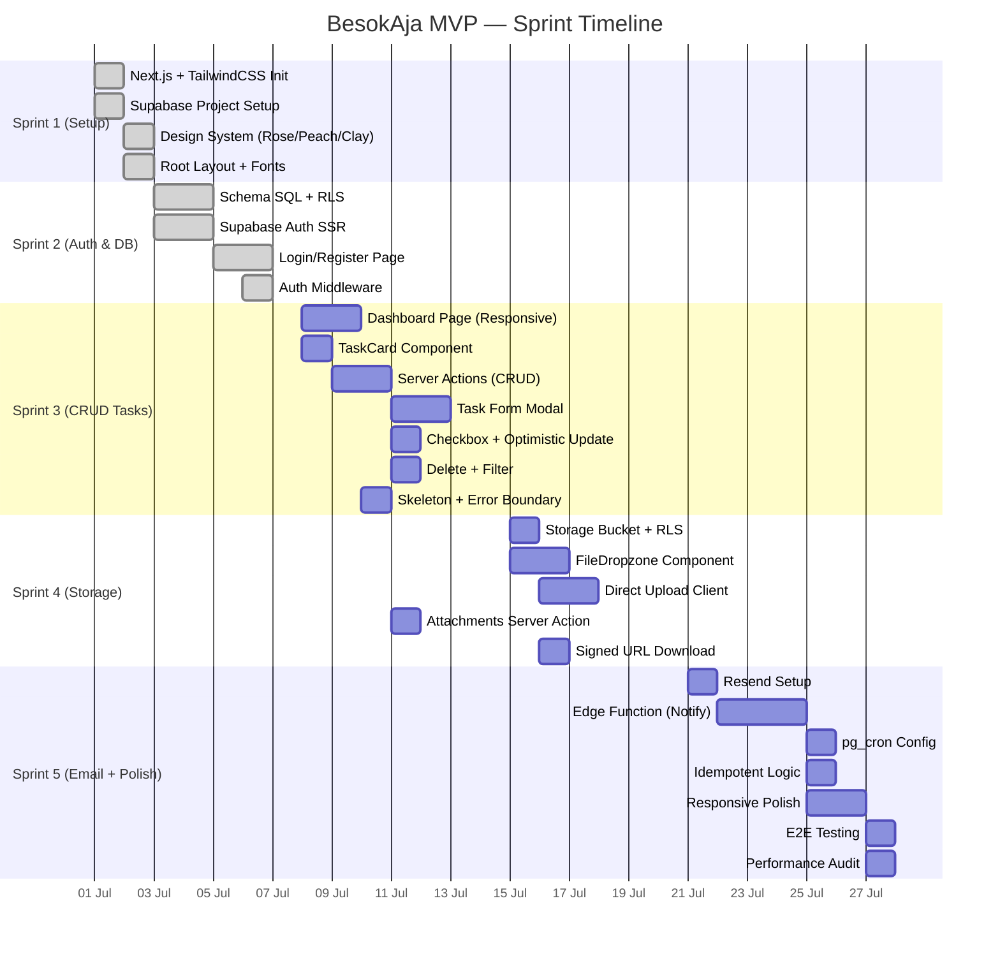

# Development Backlog & Tasks (Project BesokAja)

Dokumen ini adalah *Single Source of Truth* untuk *Developer* (atau Anda sendiri) dalam mengeksekusi iterasi (*Sprint*) tanpa harus kebingungan "Apa selanjutnya?".

---

## Definition of Done (DoD) — Berlaku untuk Semua Task

Sebuah task dianggap **selesai** jika memenuhi seluruh kriteria berikut:
- [ ] Kode berjalan tanpa error di `npm run dev` (localhost).
- [ ] Tidak ada warning TypeScript atau ESLint yang baru muncul.
- [ ] Tampilan responsif — terlihat baik di **mobile (375px)** dan **desktop (1280px)**.
- [ ] Performa tidak lag — tidak ada unnecessary re-render atau heavy DOM (cek React DevTools).
- [ ] Sesuai tema Claymorphism (shadow, radius, palet Rose/Peach).
- [ ] Fungsionalitas sudah diuji manual (happy path + 1 edge case).

---

## 🎯 Sprint 1: Arsitektur Dasar & Environment (Estimasi: 4 Hari)

| ID | Task | Est. | Dependency | Status |
|---|---|---|---|---|
| T1.1 | Setup Repositori Git dan Inisialisasi Next.js App Router (TypeScript, TailwindCSS) | 2h | — | ✅ Done |
| T1.2 | Konfigurasi Vercel CLI / Hubungkan repositori GitHub ke Vercel untuk aktivasi jalur *Preview Deployment* | 1h | T1.1 | ⬜ To-Do |
| T1.3 | Pembuatan Project di Supabase. Ekspor API Keys dan pasang pada *environment variables* lokal & Vercel | 1h | T1.1 | ✅ Done |
| T1.4 | Konfigurasi design system: token bayangan (shadow) Claymorphism, palet warna Rose/Peach (#FD92AD, #FCE2DB, #FEFEFE), integrasi `shadcn/ui` (Button, Input, Toast) | 3h | T1.1 | ✅ Done |
| T1.5 | Implementasi Layout Utama Next.js (`layout.tsx`) beserta font (Baloo 2 + Inter) | 2h | T1.4 | ✅ Done |

---

## 🔒 Sprint 2: Database & Sistem Keamanan Auth (Estimasi: 5 Hari)

| ID | Task | Est. | Dependency | Status |
|---|---|---|---|---|
| T2.1 | Desain Skema PostgreSQL di Supabase (`profiles`, `tasks`, `attachments`, `notifications_log`) | 3h | T1.3 | ✅ Done |
| T2.2 | Menulis Script RLS (Row Level Security) untuk seluruh tabel | 2h | T2.1 | ✅ Done |
| T2.3 | Implementasi Supabase Auth di Next.js (Server-Side Auth / `@supabase/ssr`) | 4h | T1.3 | ✅ Done |
| T2.4 | Pembuatan Halaman Login/Register dan implementasi *Magic Link* + Google OAuth flow | 4h | T2.3 | ✅ Done |
| T2.5 | Pembuatan Supabase Trigger Function (`handle_new_user`) agar saat mendaftar, *record* langsung terbuat di tabel `profiles` | 1h | T2.1 | ✅ Done |
| T2.6 | Implementasi Auth Middleware (session refresh, protected routes redirect) | 2h | T2.3 | ✅ Done |

---

## 🛠️ Sprint 3: Manajemen Tugas Inti (Estimasi: 6 Hari)

| ID | Task | Est. | Dependency | Status |
|---|---|---|---|---|
| T3.1 | Pembuatan halaman Dashboard (`app/dashboard/page.tsx`) dengan layout responsif (mobile stack, desktop grid) | 4h | T2.4 | ✅ Done |
| T3.2 | Pembuatan Komponen `TaskCard` dengan tema Clay dan warna prioritas baru | 3h | T1.4 | ✅ Done |
| T3.3 | Implementasi Server Actions: `createTask`, `getTasks`, `updateTaskStatus`, `deleteTask` | 4h | T2.1 | ✅ Done |
| T3.4 | Form Pembuatan Tugas (Modal) dengan validasi *Client-Side* Zod & React Hook Form | 4h | T3.3 | ✅ Done |
| T3.5 | Fitur merubah status tugas (*Update*), dari *To-Do* ke *Done* via *ClayCheckbox* — dengan optimistic update | 3h | T3.3 | ✅ Done |
| T3.6 | Implementasi filter query pada dashboard | 2h | T3.3 | ✅ Done |
| T3.7 | Loading skeleton (`dashboard/loading.tsx`) dan error boundary (`dashboard/error.tsx`) | 2h | T3.1 | ✅ Done |

---

## 📂 Sprint 4: Manajemen Penyimpanan (Estimasi: 4 Hari)

| ID | Task | Est. | Dependency | Status |
|---|---|---|---|---|
| T4.1 | Membuat Supabase Storage Bucket `task_files` | 0.5h | T1.3 | ⬜ To-Do |
| T4.2 | Menulis RLS spesifik untuk Bucket (hanya authenticated user yang dapat mengunggah, hanya pemilik task yang bisa mengunduh) | 1h | T4.1 | ⬜ To-Do |
| T4.3 | Membangun komponen `FileDropzone` — drag & drop + progress indicator, responsif untuk mobile dan desktop | 4h | T1.4 | ⬜ To-Do |
| T4.4 | Implementasi direct client-to-storage upload (Supabase JS Client) — **tanpa melalui Vercel** untuk menghindari timeout | 3h | T4.1, T4.3 | ⬜ To-Do |
| T4.5 | Modifikasi Server Action untuk menyimpan metadata file ke tabel `attachments` | 2h | T3.3, T4.4 | ⬜ To-Do |
| T4.6 | Implementasi download file dengan Signed URL (expire 1 jam) | 2h | T4.2 | ⬜ To-Do |

---

## 🤖 Sprint 5: Automasi Email & Penutupan MVP (Estimasi: 5 Hari)

| ID | Task | Est. | Dependency | Status |
|---|---|---|---|---|
| T5.1 | Integrasi akun Resend Email (Verifikasi domain / SPF / DKIM) | 2h | — | ⬜ To-Do |
| T5.2 | Membuat skrip Supabase Edge Functions (`/cron-email-reminder`) — query deadline + kirim email via Resend | 5h | T5.1, T2.1 | ⬜ To-Do |
| T5.3 | Konfigurasi trigger `pg_cron` di PostgreSQL Supabase agar memanggil Edge Function setiap jam | 1h | T5.2 | ⬜ To-Do |
| T5.4 | Logika idempotent — cek `notifications_log` sebelum kirim, insert log setelah kirim | 2h | T5.2 | ⬜ To-Do |
| T5.5 | UI Polish akhir — responsive testing (mobile 375px, tablet 768px, desktop 1280px), Claymorphism consistency check | 4h | T3.*, T4.* | ⬜ To-Do |
| T5.6 | End-to-End Testing (Manual) dari login hingga email diterima | 3h | T5.* | ⬜ To-Do |
| T5.7 | Performance audit — Lighthouse score ≥ 90, zero layout shift, no jank scroll | 2h | T5.5 | ⬜ To-Do |

---

## Task Dependency Map

---

## *Keterangan Atribut Backlog*
- **Status:** ✅ Done | ⬜ To-Do
- **Est.:** Estimasi waktu pengerjaan (jam kerja)
- **Dependency:** Task yang harus selesai terlebih dahulu
