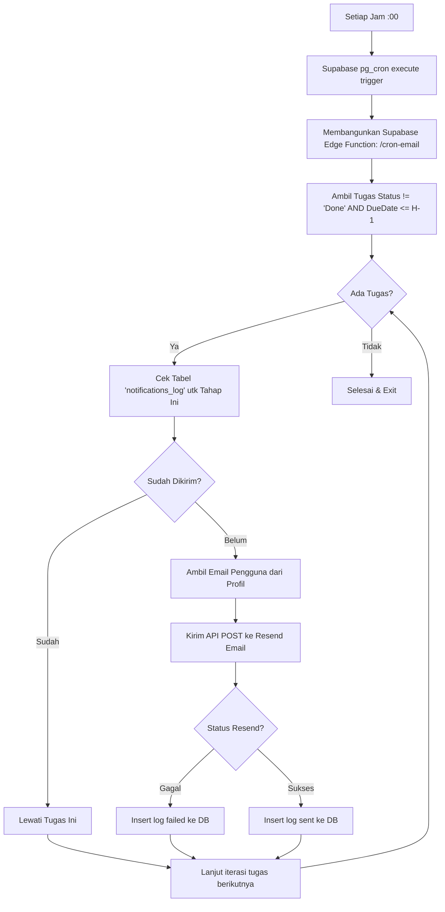

# User Flow Diagrams (Project BesokAja)

Dokumen ini memetakan alur interaksi logis dari perspektif pengguna (*user*) melalui diagram alir (Flowchart Mermaid) untuk fungsi-fungsi kritikal dalam aplikasi.

## 1. Flow Otentikasi (Oauth / Email)
Aplikasi mendukung *Magic Link* (bebas kata sandi) atau Google OAuth demi kemudahan orientasi (onboarding) yang sangat cepat tanpa hambatan.

```mermaid
graph TD
    Start[User Membuka Halaman Login] --> Pilihan{Metode Login?}
    Pilihan -->|Email/Magic Link| InputEmail[Input Email]
    InputEmail --> SendLink[Kirim Magic Link via Supabase Auth]
    SendLink --> CekInbox[User klik Link di Inbox]
    
    Pilihan -->|Google OAuth| Google[Redirect ke Halaman Google]
    Google --> Callback[Google Auth Callback]
    
    CekInbox --> Validasi[Validasi Token di Server]
    Callback --> Validasi
    
    Validasi -->|Sukses| DbCek{User Baru?}
    Validasi -->|Gagal| ShowError[Tampilkan Error / Token Kadaluarsa]
    ShowError --> Start
    
    DbCek -->|Ya| TriggerProfile[Supabase Trigger: Buat Profil]
    DbCek -->|Tidak| Lanjut
    TriggerProfile --> Lanjut[Generate Session JWT (Cookie)]
    Lanjut --> Dashboard((Masuk Dashboard))
```

## 2. Flow Manajemen Tugas (CRUD & Upload File)
Bagian tersibuk dalam sistem, di mana *Server Actions* divalidasi dan dijalankan.

```mermaid
graph TD
    Dashboard[Dashboard Utama] --> KlikAdd[Klik "Tambah Tugas Baru"]
    KlikAdd --> ModalForm[Tampil Modal Form (Client Component)]
    
    ModalForm --> InputData[Isi Judul, Deadline, Prioritas]
    InputData --> Attach{Ada Lampiran File?}
    
    Attach -->|Ada (PDF/DOCX/ZIP)| ValidasiFile[Cek Ukuran & Tipe di Klien]
    ValidasiFile -->|Tidak Valid| ErrorToast1[Tampil Toast Error]
    ValidasiFile -->|Valid| SubmitButton
    
    Attach -->|Tidak Ada| SubmitButton[Klik Simpan]
    ErrorToast1 --> ModalForm
    
    SubmitButton --> ServerAction[Submit to Next.js Server Action]
    ServerAction --> Zod[Validasi Zod Server-side]
    Zod -->|Gagal| ErrorToast2[Tampil Toast Error (Zod Issue)]
    ErrorToast2 --> ModalForm
    
    Zod -->|Sukses| CekUpload{Upload Berkas?}
    CekUpload -->|Ya| StreamUpload[Upload to Supabase Storage Bucket]
    StreamUpload --> InsertTasks[Insert DB: Tasks]
    CekUpload -->|Tidak| InsertTasks
    
    InsertTasks --> CekAttachment{Tugas dgn Berkas?}
    CekAttachment -->|Ya| InsertAttach[Insert DB: Attachments dengan Task ID]
    CekAttachment -->|Tidak| SelesaiDb
    InsertAttach --> SelesaiDb[Refresh Path]
    
    SelesaiDb --> TutupModal[Modal Tertutup & UI Terupdate]
```

## 3. Flow Sistem Automasi Peringatan Email (Cron)
Alur proses di belakang layar (Back-end System / Zero-touch) untuk mengingatkan *user*.



## 4. Analisis UX Bottlenecks & Solusi (CTO Review)
Dalam alur (journey) di atas, potensi kemacetan (bottleneck) terbesar adalah pada **Upload Berkas**. 
* **Masalah:** Jika pengguna (terutama mahasiswa) mengunggah materi ajar (PDF tebal berukuran puluhan MB) pada jaringan lambat, serverless function Next.js (Vercel) akan *time-out* sebelum form disubmit, sehingga data tugas ikut gagal tersimpan.
* **Solusi Arsitektur UX (Implemented):** Pada desain UI dan komponen formulir, proses unggah berkas dilakukan secara asinkron dari sisi klien menggunakan **Supabase Client JS secara langsung** dengan *Resumable Uploads* atau presigned URLs jika diperlukan. Tombol "Simpan Tugas" akan berubah menjadi "Mengunggah... (X%)". Server Actions Next.js HANYA dikirimkan string (berisi ID lokasi file di Storage yang sudah sukses terunggah) bersama teks tugas lainnya, sehingga menjamin performa respons yang cepat dan bebas *time-out* dari Vercel.
